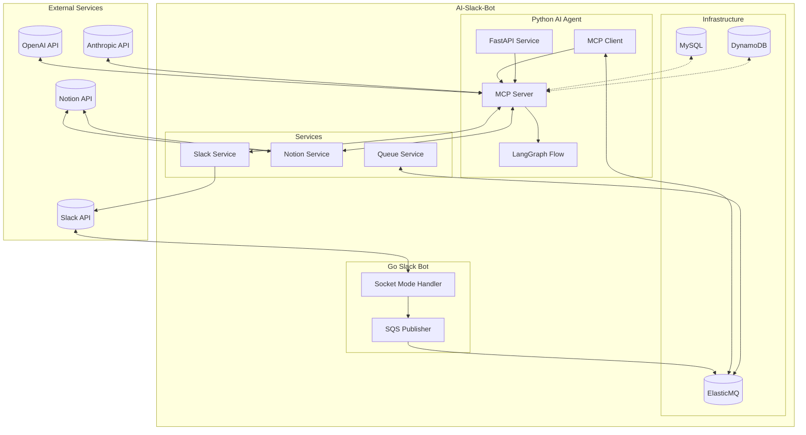

# AI Slack Bot

Slackからのメンションに対して、メッセージ内容を分析し、適切な対応を行うAIボットシステムです。

## システム概要

このシステムは以下の2つの主要コンポーネントで構成されています：

1. **Slack Bot (Go)**: Slackからのメンションを受け取り、ElasticMQキューに追加
2. **AI Agent (Python)**: ElasticMQからメッセージを取得し、LLMを使用して分析・処理

## アーキテクチャ



## 処理フロー

1. Goで実装されたSlack Botがメンションを受け取る
2. メンションデータをElasticMQキューに追加
3. PythonのMCP Clientがキューからメッセージを取得
4. MCP Serverがメンションの内容をLLMで分析
5. 適切な応答を生成
6. 必要に応じてNotionにタスクを作成
7. Slackに応答を返す

## コンポーネント一覧

### Slack Bot (Go)

- Socket Mode APIを使用してSlackイベントをリアルタイムに受信
- メンションをElasticMQキューに追加

詳細は [slack_bot/README.md](slack_bot/README.md) を参照

### AI Agent (Python)

- LangChainとLangGraphを使用したMCPアーキテクチャ
- ElasticMQからのメッセージを処理
- LLMを使用してメッセージ内容を分析し適切な応答を生成
- 必要に応じてNotionにタスクを作成

詳細は [ai_agent/README.md](ai_agent/README.md) を参照

## インフラストラクチャ

- **ElasticMQ**: SQS互換のメッセージキューシステム
- **MySQL**: 永続データ保存用
- **DynamoDB**: 高速アクセスが必要なデータ用

## セットアップ方法

### 必要条件

- Go 1.16+
- Python 3.9+
- Docker と Docker Compose
- 各種APIキー (Slack, Notion, Anthropic/OpenAI)

### インストール手順

1. リポジトリをクローン

```bash
git clone https://github.com/username/ai-slack-bot.git
cd ai-slack-bot
```

2. Dockerを使用して環境を構築

```bash
docker-compose up -d
```

3. 各コンポーネントの設定

```bash
# Slack Bot
cp slack_bot/config/config.example.yml slack_bot/config/config.yml
# config.ymlを編集

# AI Agent
cp ai_agent/.env.example ai_agent/.env
# .envファイルを編集
```

## 開発ガイド

各コンポーネントの開発に関する詳細情報は、それぞれのREADMEを参照してください：

- [Slack Bot 開発ガイド](slack_bot/README.md)
- [AI Agent 開発ガイド](ai_agent/README.md)

## トラブルシューティング

一般的な問題と解決策：

- Slack連携の問題: Slack App設定を確認（Botトークン権限、Socket Mode設定など）
- ElasticMQ接続エラー: `docker-compose logs elasticmq` でログを確認
- LLM API Keyのエラー: .env設定を確認