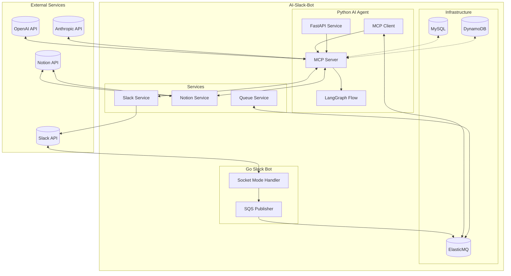
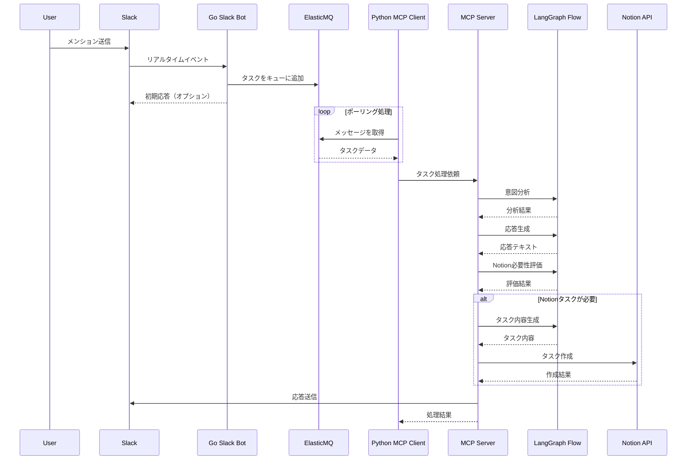
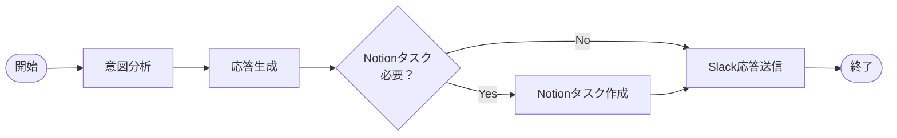

# AI Slack Bot

Slackからのメンションに対して、メッセージ内容を分析し、適切な対応を行うAIボットシステムです。

## システム概要

このシステムは以下の2つの主要コンポーネントで構成されています：

1. **Slack Bot (Go)**: Slackからのメンションを受け取り、ElasticMQキューに追加
2. **AI Agent (Python)**: ElasticMQからメッセージを取得し、LLMを使用して分析・処理

## 技術スタック

### 言語とフレームワーク

- **Go**: Slack Bot実装 (slack-go/slack ライブラリ使用)
- **Python**: AI Agent実装
  - FastAPI: APIエンドポイント提供
  - LangChain & LangGraph: LLMオーケストレーション
  - Pydantic: データバリデーション

### インフラストラクチャ

- **ElasticMQ**: 非同期処理用SQS互換メッセージキュー
- **Docker**: 全コンポーネントのコンテナ化
- **MySQL**: 永続データ保存
- **DynamoDB**: 高速データアクセス

### 外部サービス

- **Slack API**: メンション受信と応答送信
- **Notion API**: フォローアップタスク作成
- **LLMプロバイダー**:
  - Anthropic Claude (主要)
  - OpenAI GPTモデル (二次)

## フォルダ構造

```text
ai-slack-bot/
├── ai_agent/               # Python製AIエージェント
│   ├── agents/             # MCPアーキテクチャ実装
│   │   ├── mcp_client.py   # キューメッセージ処理クライアント
│   │   └── mcp_server.py   # LLM処理サーバー
│   ├── services/           # 外部サービス連携
│   │   ├── notion_service.py  # Notion API連携
│   │   ├── queue_service.py   # ElasticMQ連携
│   │   └── slack_service.py   # Slack API連携
│   ├── api.py              # FastAPIエンドポイント
│   ├── config.py           # 設定
│   ├── main.py             # メインエントリーポイント
│   └── models.py           # データモデル
├── slack_bot/              # Go製Slackボット
│   ├── cmd/                # コマンドラインエントリーポイント
│   │   └── main.go         # メインGoアプリケーション
│   └── config/             # 設定
├── docker-compose.yml      # Dockerサービス定義
└── elasticmq.conf          # ElasticMQ設定
```

## アーキテクチャ



## メッセージ処理フロー



## LLM処理フロー

AI Agentでのメッセージ処理は、LangGraphで実装された以下のステップで構成されます：



1. **意図分析**: メッセージの目的と要求を特定
2. **応答生成**: 意図に基づいて適切な返答を作成
3. **Notion必要性評価**: フォローアップタスクが必要かを判断
4. **タスク作成**: 必要に応じてNotionにタスクを登録
5. **応答送信**: 生成した返答をSlackに送信

## コンポーネント詳細

### Slack Bot (Go)

- Socket Mode APIによるリアルタイムイベント処理
- メンション検知とElasticMQへのキューイング
- 設定管理（Viperライブラリ使用）

詳細は [slack_bot/README.md](slack_bot/README.md) を参照

### AI Agent (Python)

- LangChainとLangGraphを使用したMCPアーキテクチャ
- ElasticMQからのメッセージポーリング
- LLMによるコンテキスト分析と応答生成
- Notion統合によるタスク管理

詳細は [ai_agent/README.md](ai_agent/README.md) を参照

## セットアップ方法

### 必要条件

- Go 1.16+
- Python 3.9+
- Docker と Docker Compose
- 各種APIキー (Slack, Notion, Anthropic/OpenAI)

### インストール手順

1. リポジトリをクローン

```bash
git clone https://github.com/username/ai-slack-bot.git
cd ai-slack-bot
```

2. Dockerを使用して環境を構築

```bash
docker-compose up -d
```

3. 各コンポーネントの設定

```bash
# Slack Bot
cp slack_bot/config/config.example.yml slack_bot/config/config.yml
# config.ymlを編集

# AI Agent
cp ai_agent/.env.example ai_agent/.env
# .envファイルを編集
```

### 実行方法

Taskfileを使用して各コンポーネントを起動できます：

```bash
# Slack Botの起動
task slack-bot

# AI Agentの起動
task ai-agent
```

または、各コンポーネントを個別に起動：

```bash
# Slack Bot
cd slack_bot && go run cmd/main.go

# AI Agent
cd ai_agent && python main.py
```

## 開発ガイド

各コンポーネントの開発に関する詳細情報は、それぞれのREADMEを参照してください：

- [Slack Bot 開発ガイド](slack_bot/README.md)
- [AI Agent 開発ガイド](ai_agent/README.md)

## トラブルシューティング

一般的な問題と解決策：

- **Slack連携の問題**: Slack App設定を確認（Botトークン権限、Socket Mode設定など）
- **ElasticMQ接続エラー**: `docker-compose logs elasticmq` でログを確認
- **LLM API Keyのエラー**: .env設定を確認
- **データベース接続エラー**: MySQLまたはDynamoDBの接続設定を確認
