# AI Agent for Slack Bot

このモジュールは、Slackからのメンションを受け取り、LLMを使用して内容を分析し、適切な応答を生成するAIエージェントです。

## 機能概要

- Slackメンションの受信と処理
- LangChainとLangGraphを使用したMCPアーキテクチャの実装
- ElasticMQを使用した非同期メッセージ処理
- Notionへのタスク自動作成機能
- FastAPIを使用したRESTエンドポイント提供

## アーキテクチャ

システムは以下のコンポーネントで構成されています：

1. **MCP Client**: ElasticMQキューからメッセージをポーリングし、処理を行うコンポーネント
2. **MCP Server**: LangGraphを使用してメッセージ分析とレスポンス生成を行うコンポーネント
3. **Services**:
   - SlackService: Slack APIとの通信を担当
   - NotionService: Notion APIとの通信を担当
   - QueueService: ElasticMQとの通信を担当

### アーキテクチャ図

```mermaid
flowchart TB
    subgraph "External Services"
        Slack[(Slack API)]
        Notion[(Notion API)]
        OpenAI[(OpenAI API)]
        Anthropic[(Anthropic API)]
    end

    subgraph "AI-Slack-Bot"
        subgraph "Infrastructure"
            API[FastAPI Service]
            SQS[(ElasticMQ)]
            DB[(MySQL)]
            DDB[(DynamoDB)]
        end
        
        subgraph "AI Agent"
            Client[MCP Client]
            Server[MCP Server]
            LGraph[LangGraph Flow]
        end
        
        subgraph "Services"
            SS[Slack Service]
            NS[Notion Service]
            QS[Queue Service]
        end
    end
    
    Slack <--> SS
    Notion <--> NS
    OpenAI <--> Server
    Anthropic <--> Server
    
    API --> Client
    API --> Server
    
    Client <--> SQS
    Client --> Server
    
    Server --> LGraph
    Server <--> SS
    Server <--> NS
    
    SS --> Slack
    NS --> Notion
    QS <--> SQS
    
    DB <-.-> Server
    DDB <-.-> Server
    
    class OpenAI,Anthropic,Slack,Notion external;
    class SS,NS,QS service;
    class API,SQS,DB,DDB infrastructure;
    class Client,Server,LGraph core;
    
    classDef external fill:#f9f,stroke:#333,stroke-width:2px;
    classDef service fill:#bbf,stroke:#33f,stroke-width:1px;
    classDef infrastructure fill:#bfb,stroke:#3f3,stroke-width:1px;
    classDef core fill:#fbb,stroke:#f33,stroke-width:1px;
```



## セットアップ方法

### 必要条件

- Python 3.9+
- Docker と Docker Compose
- 各種APIキー (Slack, Notion, Anthropic/OpenAI)

### インストール手順

1. 依存パッケージのインストール

```bash
pip install -r requirements.txt
```

2. 環境変数の設定

`.env.example` を `.env` にコピーして、必要な環境変数を設定します。

```bash
cp .env.example .env
# .envファイルを編集して各種APIキーなどを設定
```

3. Dockerでの実行

リポジトリのルートディレクトリで以下のコマンドを実行します。

```bash
docker-compose up -d
```

## API エンドポイント

### ヘルスチェック

```
GET /health
```

### メンション処理

```
POST /process-mention
```

リクエスト本文:
```json
{
  "text": "メンションテキスト",
  "user": "ユーザーID",
  "channel": "チャンネルID",
  "ts": "タイムスタンプ",
  "thread_ts": "スレッドタイムスタンプ（オプション）"
}
```

### 直接処理（テスト用）

```
POST /process-directly
```

リクエスト本文は `/process-mention` と同じです。

## 処理フロー

1. Slackからのメンションを受け取る
2. メンションの内容をLLMで分析
3. 適切な応答を生成
4. 必要に応じてNotionにタスクを作成
5. Slackに応答を返す

### シーケンス図


## LangGraphフロー

メッセージ処理は以下のノードで構成されるLangGraphで制御されています：

1. `analyze_intent`: メッセージの意図を分析
2. `generate_slack_response`: Slack用の応答を生成
3. `evaluate_notion_need`: Notionタスクの必要性を評価
4. `create_notion_task`: Notionタスクを作成（必要な場合のみ）
5. `send_slack_response`: Slackに応答を送信

### フロー図


## 開発ガイド

新しい機能を追加する場合は、以下のディレクトリ構造に従ってください：

- `agents/`: MCP関連のコンポーネント
- `services/`: 外部APIとの通信用サービス
- `models.py`: データモデル定義

## トラブルシューティング

- ログは標準出力およびログファイルに記録されます
- API連携に問題がある場合は、各サービスの認証情報を確認してください
- Dockerコンテナが起動しない場合は、`docker-compose logs`で詳細を確認してください
