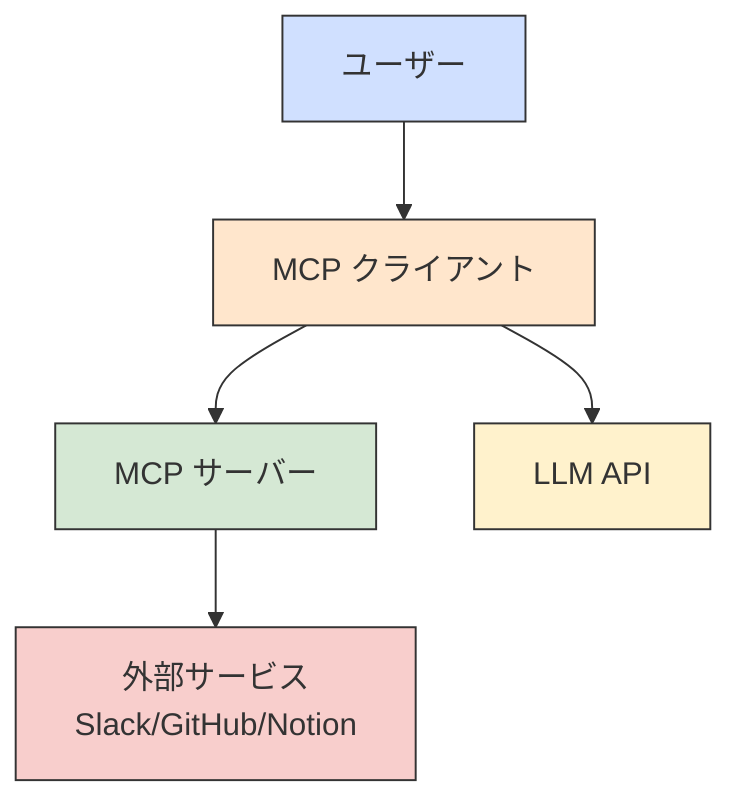
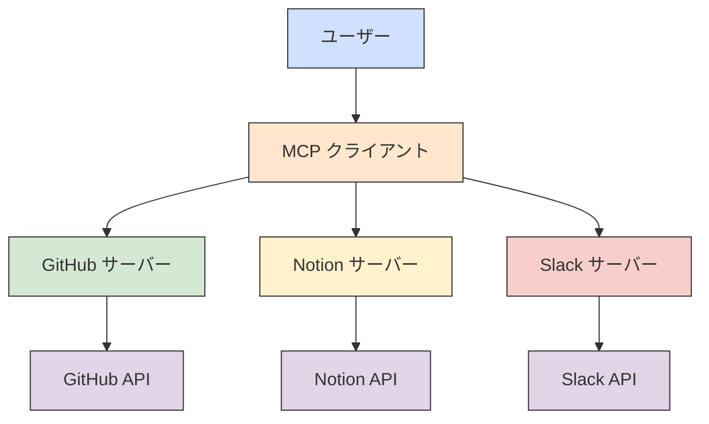
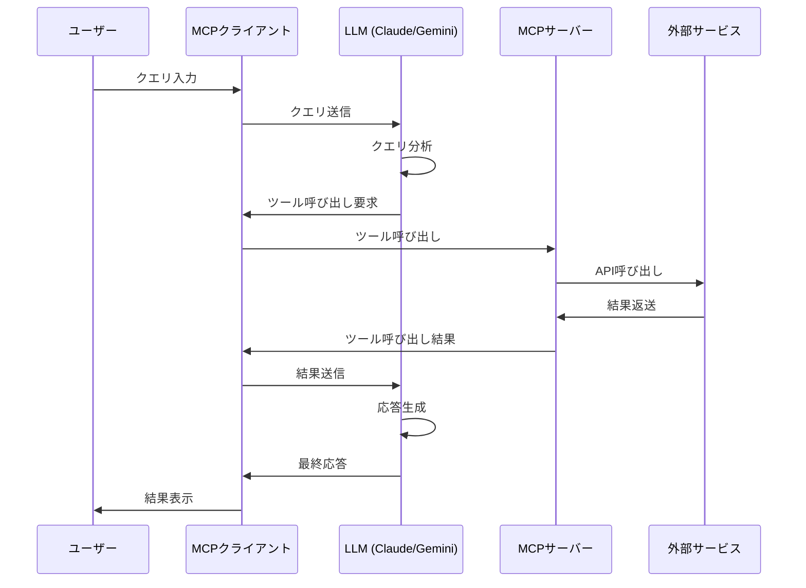
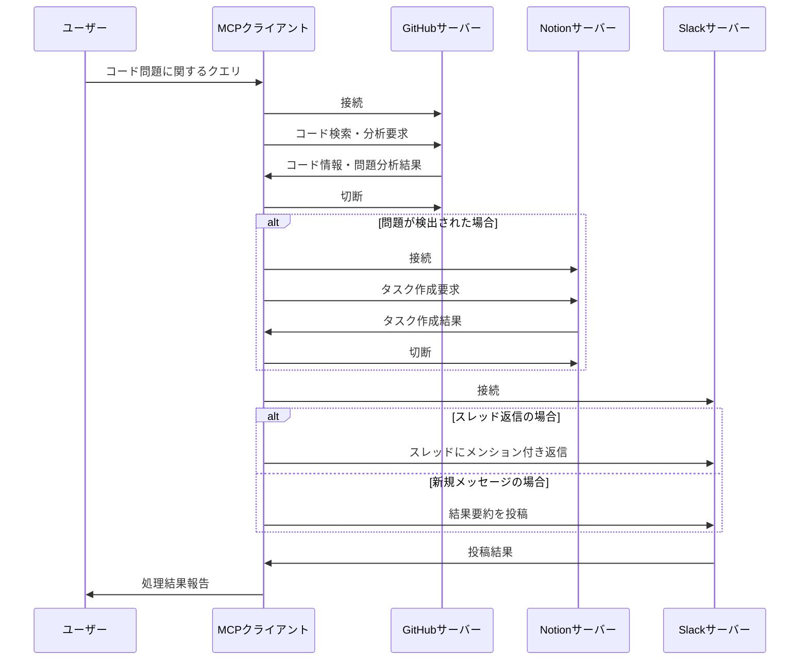

# MCP Client

## 概要

MCP Client は、Model Context Protocol (MCP) サーバーと通信するための Python クライアントです。SlackやGitHub、Notionなどの外部サービスとの連携を可能にし、大規模言語モデル（LLM）を使用してこれらのサービスとインタラクションできます。コードの問題を検出し、Notionにタスクを作成し、Slackで結果を共有するクロスサーバーワークフローをサポートします。

## アーキテクチャ

### 基本アーキテクチャ



### マルチサーバー連携アーキテクチャ



## 処理フロー

### 通常の処理フロー



### クロスサーバー処理フロー（GitHub → Notion → Slack）



## 機能と実装

### MCPClient クラス

クライアントの中核となるクラスで、MCPサーバーとの接続や通信を管理します。

#### 主要メソッド

| メソッド名 | 説明 |
|------------|------|
| `__init__` | クライアントの初期化。モデルプロバイダー（geminiまたはanthropic）を設定 |
| `connect_to_server` | 指定されたMCPサーバー（Slack、GitHub、Notionなど）に接続 |
| `process_query` | ユーザークエリを処理。適切な処理方法を決定。スレッド情報も処理 |
| `_process_cross_server_query` | 複数サーバー間の連携処理を実行（GitHub→Notion→Slack） |
| `_process_with_anthropic` | Claude（Anthropic）を使用してクエリを処理 |
| `_process_with_gemini` | Gemini（Google）を使用してクエリを処理 |
| `_extract_github_info` | GitHubからのコード検索・問題分析を実行 |
| `_analyze_code_issues` | 取得したコードの問題点を分析 |
| `_create_notion_task` | Notionにタスクを作成 |
| `_post_to_slack` | Slackへの投稿を処理 |
| `_reply_to_slack_thread` | Slackスレッドへメンション付きで返信 |
| `_process_claude_response` | Claude応答の処理とツール呼び出しの管理 |
| `_process_tool_arguments` | ツール引数の処理と準備 |
| `_execute_tool_call` | ツール呼び出しの実行 |
| `_extract_tool_content` | ツール応答からのコンテンツ抽出 |
| `chat_loop` | 対話型のチャットループを実行。スレッド情報も処理 |
| `cleanup` | リソースのクリーンアップ |

## 設定ファイル

### スキーマファイル

`schema` ディレクトリには各サーバーの設定を含むJSONファイルがあります：

- `slack.json`: Slack MCPサーバーの設定
- `github.json`: GitHub MCPサーバーの設定
- `notion.json`: Notion MCPサーバーの設定

## 使用方法

```bash
# Geminiモード（デフォルト、シンプル）でSlackサーバーに接続
uv run client.py --server slack

# Anthropicモード（フル機能）でSlackサーバーに接続
uv run client.py --server slack --model anthropic

# GitHubサーバーに接続
uv run client.py --server github

# Notionサーバーに接続
uv run client.py --server notionApi

# 非対話モードでクエリを実行（Slackスレッド返信用）
uv run client.py --server slack --query "コード検索とタスク作成をしてください" --thread "1620841956.009700" --user "U01ABC123"
```

## 依存関係

- `anthropic`: Claude APIとの通信
- `google-generativeai`: Gemini APIとの通信
- `mcp`: Model Context Protocol実装
- `python-dotenv`: 環境変数の読み込み

## 拡張性

このクライアントは、新しいMCPサーバーの追加が容易な設計になっています。新しいサービスを追加するには：

1. 対応するスキーマファイルを `schema` ディレクトリに追加
2. 必要に応じてクロスサーバー処理ロジックを拡張
3. 新しいサービス用の処理メソッドを追加（必要に応じて）
4. ツール呼び出し処理を実装

### クロスサーバーフロー拡張

クロスサーバーフローのパターンを拡張して、GitHub→Notion→Slackだけでなく、他のサービス組み合わせも実装可能です：

- Notion→GitHub（例：タスクからプルリクエスト作成）
- Slack→GitHub→Slack（例：会話内容からコード生成してPRを作成）
- GitHub→Notion→Email（例：バグ報告と修正タスク作成、担当者へ通知）

## 参考URL

- [Model Context Protocol](https://modelcontextprotocol.io/quickstart/client)
- [Anthropic Claude API](https://docs.anthropic.com/claude/reference/getting-started-with-the-api)
- [Google Gemini API](https://ai.google.dev/docs)
