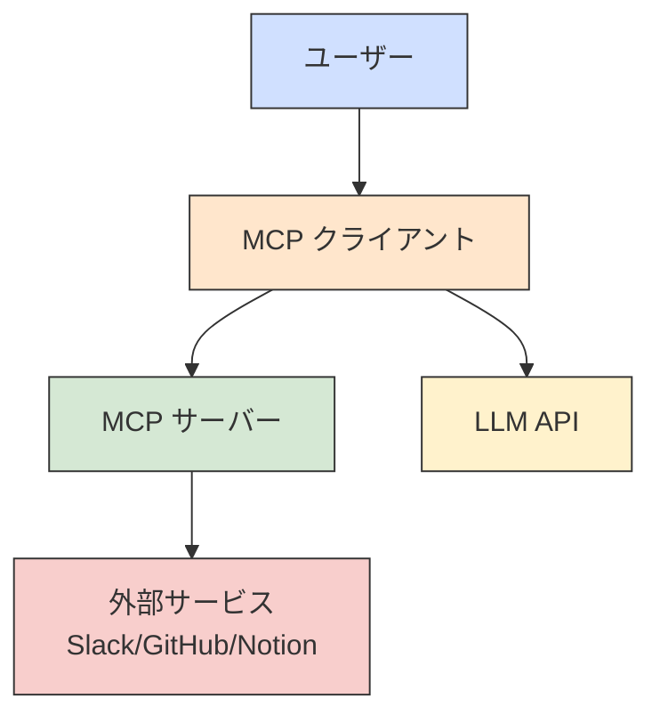
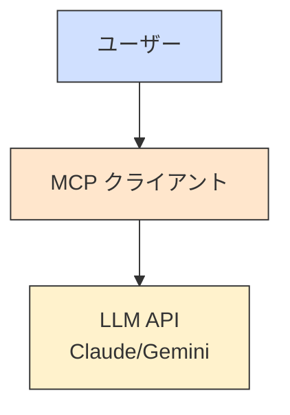
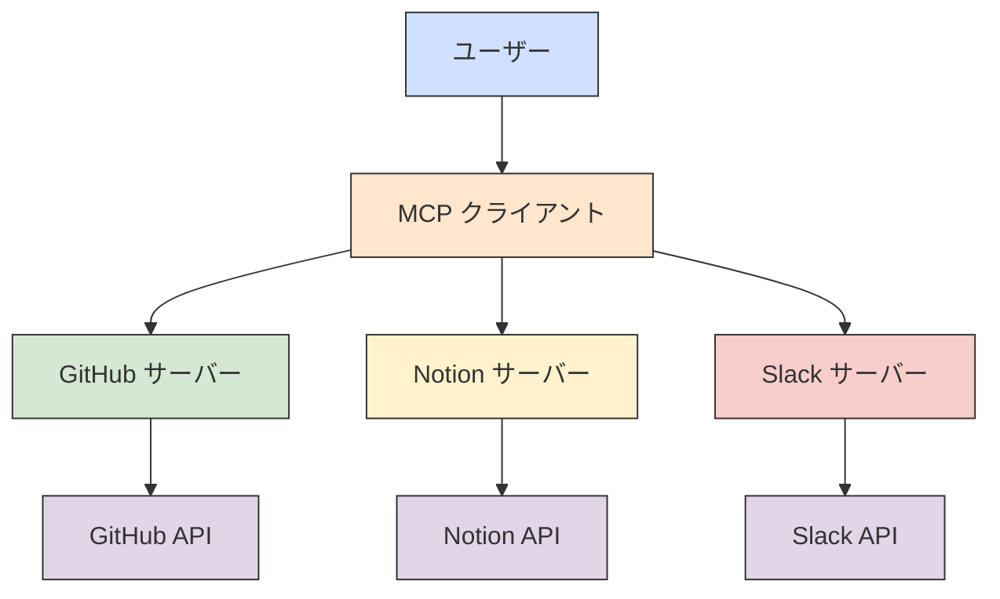
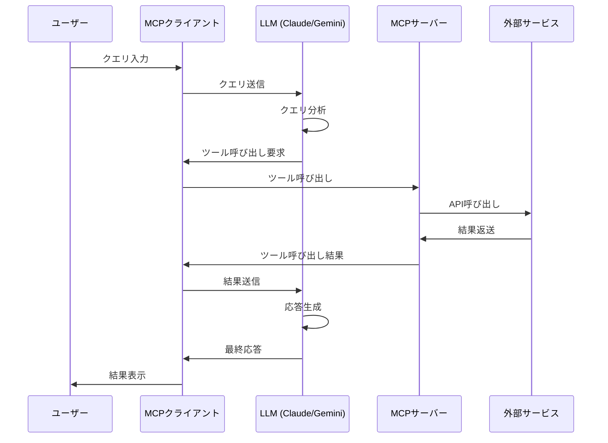
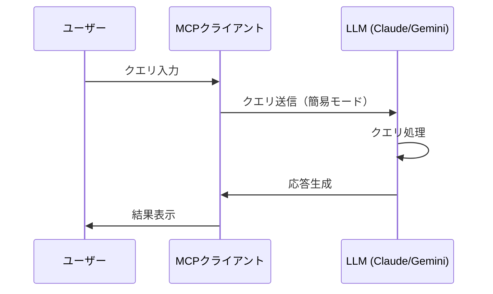
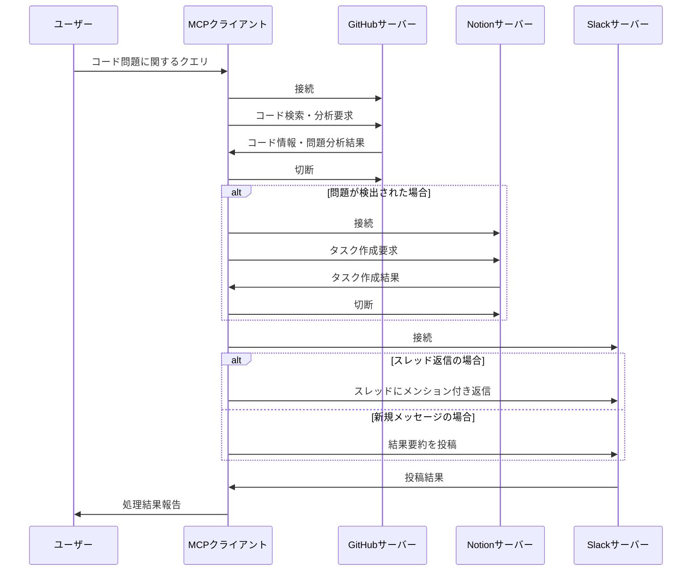
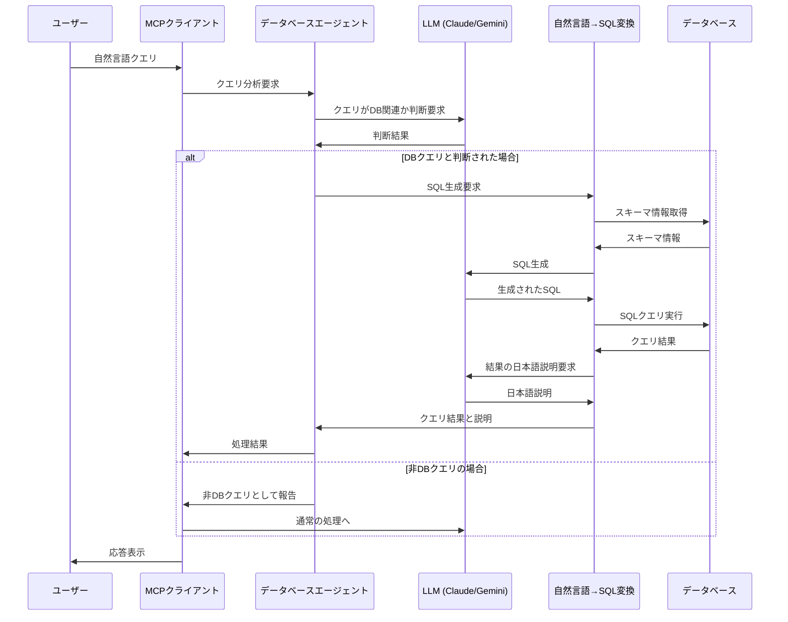

# MCP Client

## 概要

MCP Client は、Model Context Protocol (MCP) サーバーと通信するための Python クライアントです。SlackやGitHub、Notionなどの外部サービスとの連携を可能にし、大規模言語モデル（LLM）を使用してこれらのサービスとインタラクションできます。コードの問題を検出し、Notionにタスクを作成し、Slackで結果を共有するクロスサーバーワークフローをサポートします。

LangChainフレームワークを活用しており、モデルとツールの連携を効率的に実現します。簡易モードと完全モードの2つの動作モードに対応し、外部サービスへのアクセスなしでモデルを直接利用することも、フルAPIアクセスを行うこともできます。

## コード構成

```
mcp-client/
├── client.py (メインエントリーポイント)
├── config.py (設定管理)
├── core/
│   ├── __init__.py
│   ├── base.py (ベースクラスと共通機能)
│   ├── session.py (サーバー接続とセッション管理)
│   └── utils.py (ユーティリティ関数)
├── database/
│   ├── __init__.py
│   ├── agent.py (データベースクエリエージェント)
│   ├── connection.py (データベース接続管理)
│   └── query.py (自然言語→SQL変換)
├── models/
│   ├── __init__.py
│   ├── anthropic.py (Anthropic/Claude関連)
│   └── gemini.py (Google Gemini関連)
├── services/
│   ├── __init__.py
│   ├── github.py (GitHub関連機能)
│   ├── notion.py (Notion関連機能)
│   └── slack.py (Slack関連機能)
├── tools/
│   ├── __init__.py
│   └── handlers.py (ツール呼び出し処理)
└── schema/
    ├── github.json
    ├── notion.json
    └── slack.json
```

## アーキテクチャ

### 基本アーキテクチャ

#### 完全モード (Full Mode)



#### 簡易モード (Simple Mode)



### マルチサーバー連携アーキテクチャ



### データベース連携アーキテクチャ

```mermaid
graph TD
    A[ユーザー] --> B[MCP クライアント]
    B --> C[LLM (Claude/Gemini)]
    B --> D[データベースエージェント]
    D --> E[自然言語→SQL変換]
    D --> F[データベース接続]
    F --> G[データベース\nMySQL/PostgreSQL/SQLite]
    
    classDef user fill:#d0e0ff,stroke:#333,stroke-width:1px;
    classDef client fill:#ffe6cc,stroke:#333,stroke-width:1px;
    classDef llm fill:#fff2cc,stroke:#333,stroke-width:1px;
    classDef db fill:#d5e8d4,stroke:#333,stroke-width:1px;
    classDef service fill:#f8cecc,stroke:#333,stroke-width:1px;
    
    class A user;
    class B client;
    class C llm;
    class D,E,F db;
    class G service;
```

## 処理フロー

### 基本的な処理フロー

#### 完全モードの処理フロー



#### 簡易モードの処理フロー



### クロスサーバー処理フロー（GitHub → Notion → Slack）



### データベースクエリ処理フロー



## 主要クラスとモジュール

### メインクラス

- **MCPClient**: メインのクライアントクラスで、簡易モードと完全モードの両方を処理します
  - 接続モード: `ConnectionMode.SIMPLE`（簡易モード）または`ConnectionMode.FULL`（完全モード）
  - モデルプロバイダー: `anthropic`（Claude）または`gemini`（Google Gemini）
  - 簡易モードでは直接モデルAPIを呼び出し、完全モードではサーバー接続と複雑な操作を処理します
  - LangChain統合: 会話履歴の追跡、プロンプト管理、ツール連携を実現

### コアモジュール (core/)

- **BaseMCPClient**: 基本的なセッション管理とクリーンアップ機能を提供
- **SessionManager**: MCPサーバーとの接続管理、LangChainツールの準備と管理
- **ServerConnector**: サーバーパラメータ生成
- **MCPToolWrapper**: MCPツールをLangChainのToolとしてラップする

### モデルモジュール (models/)

- **AnthropicModelHandler**: LangChain経由でClaude APIを利用した処理（簡易モード・完全モード対応）
  - `process_query_simple`: 簡易モードでの処理
  - `process_query`: 完全モードでの処理（ツール利用）
  - `process_structured_query`: JSON形式の構造化出力を生成
- **GeminiModelHandler**: LangChain経由でGemini APIを利用した処理（簡易モード・完全モード対応）
  - `process_query_simple`: 簡易モードでの処理
  - `process_query`: 完全モードでの処理（ツール利用）
  - `process_structured_query`: JSON形式の構造化出力を生成

### ツールモジュール (tools/)

- **ToolManager**: MCPツールの管理と呼び出し、LangChainツールの生成と管理
- **LangChainToolAdapter**: MCPツールをLangChainのToolとして利用するためのアダプターを提供

### サービスモジュール (services/)

- **GitHubService**: GitHub連携機能
- **NotionService**: Notion連携機能
- **SlackService**: Slack連携機能

### データベースモジュール (database/)

- **DatabaseConnection**: データベース接続を管理するクラス
  - `connect()`: データベースに接続
  - `execute_raw_query()`: SQLクエリを実行
  - `get_schema_info()`: データベーススキーマの説明を取得
  - LangChainのSQLDatabaseを内部的に使用
- **NaturalLanguageQueryProcessor**: 自然言語からSQLクエリを生成するクラス
  - `process_query()`: 自然言語クエリを処理しSQL実行結果を返す
  - LangChainのSQL生成チェーンを使用
- **DatabaseQueryAgent**: 自然言語でデータベースに問い合わせるエージェント
  - `is_database_query()`: クエリがデータベース関連かを判断
  - `process_query()`: 適切な処理を選択して実行

### 設定モジュール (config.py)

- 環境変数の管理
- モデル設定
- LangChain関連の設定（温度、トークン制限、システムプロンプト）
- サーバースキーマの読み込み
- データベース設定（タイプ、接続情報、スキーマ説明）

## 使用方法

### 動作モード

MCPクライアントには2つの動作モードがあります：

- **簡易モード (simple)**: 外部サービスに接続せず、LLMに直接クエリを送信します。API連携を必要としない簡単な質問や会話に適しています。
- **完全モード (full)**: MCPサーバーを介して外部サービス（Slack、GitHub、Notion）に接続し、APIツールを利用した高度な機能を提供します。

### 基本的なコマンド

```bash
# 簡易モード - Gemini (外部サービス連携なし)
uv run client.py --mode simple --model gemini

# 簡易モード - Claude (外部サービス連携なし)
uv run client.py --mode simple --model anthropic

# 完全モード - Gemini - Slackサーバーに接続
uv run client.py --mode full --server slack --model gemini

# 完全モード - Claude - Slackサーバーに接続
uv run client.py --mode full --server slack --model anthropic

# 完全モード - GitHubサーバーに接続
uv run client.py --mode full --server github

# 完全モード - Notionサーバーに接続
uv run client.py --mode full --server notion

# 非対話モードでクエリを実行（Slackスレッド返信用）
uv run client.py --mode full --server slack --query "コード検索とタスク作成をしてください" --thread "1620841956.009700" --user "U01ABC123"
```

### 互換性のため、以下の従来のコマンドもサポート（--modeオプションなし、デフォルトで完全モード）

```bash
# 完全モード - Gemini - Slackサーバーに接続
uv run client.py --server slack

# 完全モード - Claude - Slackサーバーに接続
uv run client.py --server slack --model anthropic
```

## 依存関係

- `anthropic`: Claude APIとの通信
- `google-generativeai`: Gemini APIとの通信
- `mcp`: Model Context Protocol実装
- `python-dotenv`: 環境変数の読み込み
- `langchain`: LLMやツールを組み合わせるためのフレームワーク
- `langchain-anthropic`: LangChainとAnthropic Claude APIの連携
- `langchain-google-genai`: LangChainとGoogle Gemini APIの連携
- `langchain-core`: LangChainのコア機能（プロンプト、チェーン、出力処理など）
- `langchain-sql`: LangChainのSQL生成と実行機能
- `sqlalchemy`: データベース操作のためのORMとSQLツールキット
- `mysqlclient`: MySQLデータベースドライバ
- `psycopg2-binary`: PostgreSQLデータベースドライバ

## 拡張性

このクライアントは、新しいMCPサーバーの追加が容易な設計になっています。新しいサービスを追加するには：

1. 対応するスキーマファイルを `schema` ディレクトリに追加
2. 必要に応じて新しいサービスクラスを `services/` に追加
3. 必要に応じてクロスサーバー処理ロジックを拡張
4. ツール呼び出し処理を実装

### データベース機能の設定

データベースへの接続と自然言語クエリ機能を使用するには：

1. 環境変数で接続情報を設定：
   ```
   DB_TYPE=mysql  # mysql, postgresql, sqlite のいずれか
   DB_HOST=localhost
   DB_PORT=3306
   DB_USER=username
   DB_PASSWORD=password
   DB_NAME=your_database
   DB_SCHEMA_DESCRIPTION="データベースのテーブルと列に関する説明"  # オプション
   ```

2. サポートされているデータベース：
   - MySQL
   - PostgreSQL
   - SQLite

3. 使用例：
   ```
   # 自然言語でデータベース検索
   uv run client.py --mode simple --model anthropic
   > データベースの全ユーザー数を教えて
   > アクティブなプロジェクトを開始日の新しい順に5件表示して
   > user_idが10のユーザーが担当しているタスクの完了率は？
   ```

### クロスサーバーフロー拡張

クロスサーバーフローのパターンを拡張して、GitHub→Notion→Slackだけでなく、他のサービス組み合わせも実装可能です：

- Notion→GitHub（例：タスクからプルリクエスト作成）
- Slack→GitHub→Slack（例：会話内容からコード生成してPRを作成）
- GitHub→Notion→Email（例：バグ報告と修正タスク作成、担当者へ通知）
- Slack→データベース→Slack（例：会話内容からデータ検索して結果を投稿）

## 参考URL

- [Model Context Protocol](https://modelcontextprotocol.io/quickstart/client)
- [Anthropic Claude API](https://docs.anthropic.com/claude/reference/getting-started-with-the-api)
- [Google Gemini API](https://ai.google.dev/docs)
- [LangChain](https://www.langchain.com/)
- [LangChain ドキュメント](https://python.langchain.com/docs/get_started/introduction)
- [LangChain SQL ドキュメント](https://python.langchain.com/docs/modules/chains/popular/sqlite)
- [SQLAlchemy ドキュメント](https://docs.sqlalchemy.org/)
- [自然言語からSQLへの変換](https://python.langchain.com/docs/use_cases/sql/sql_database)
