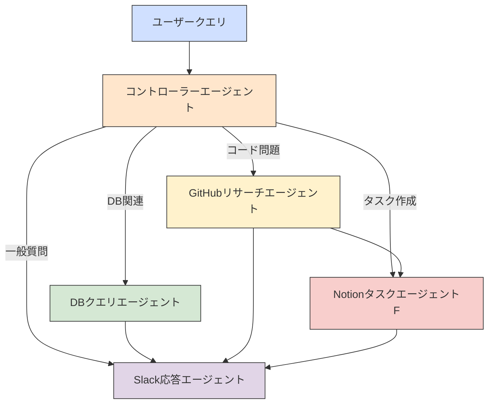
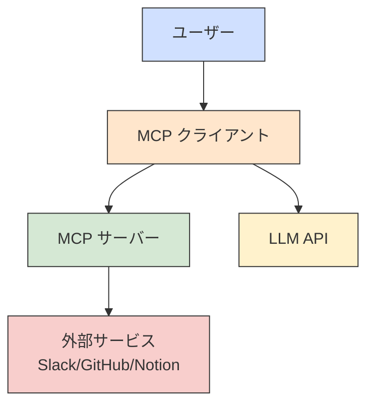
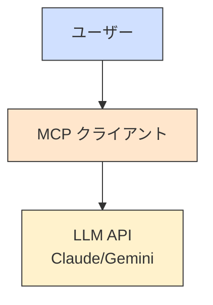
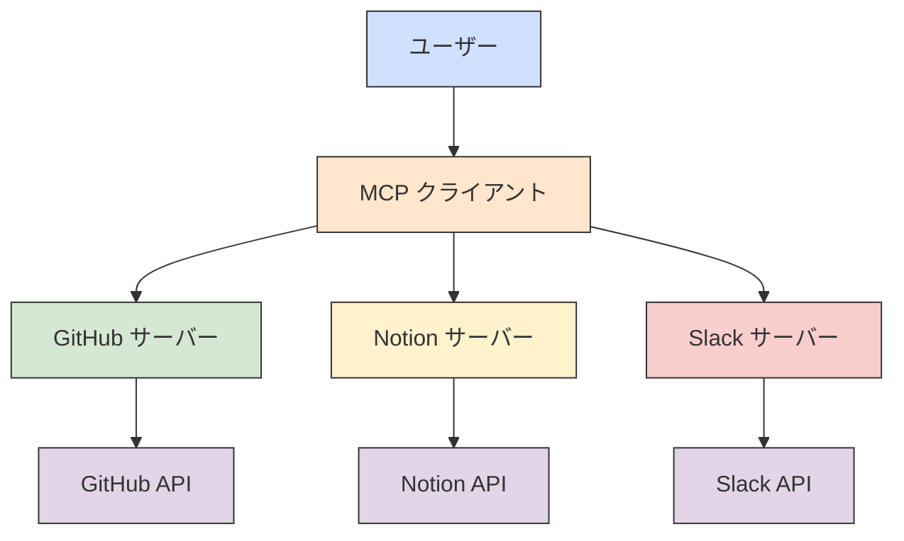
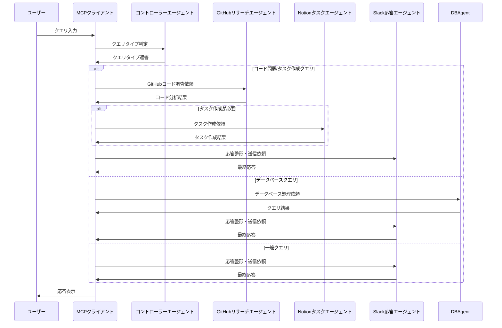
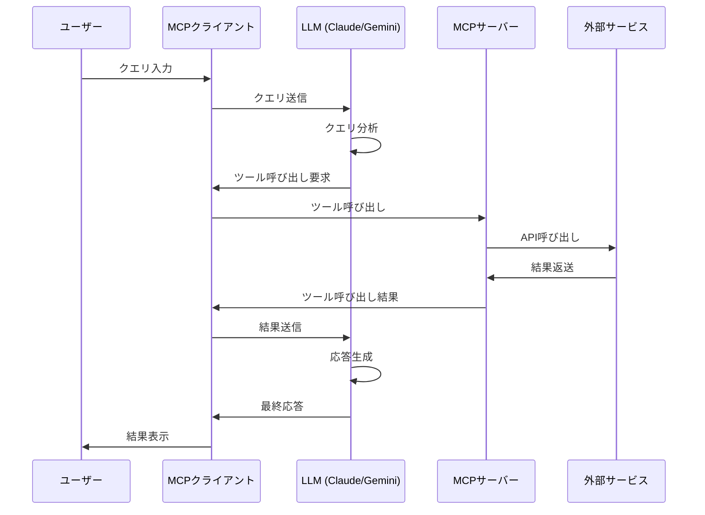
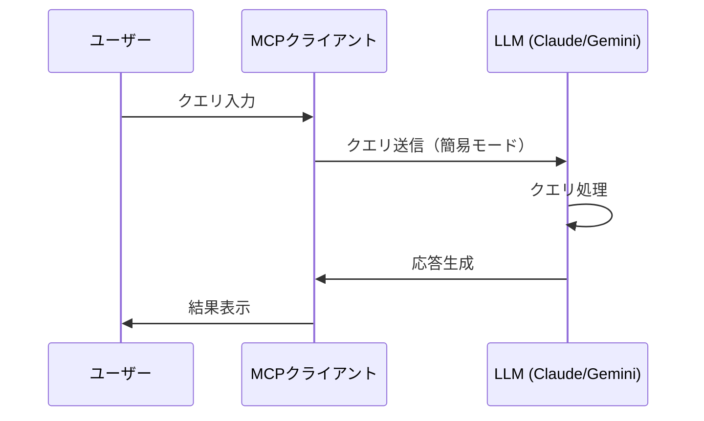
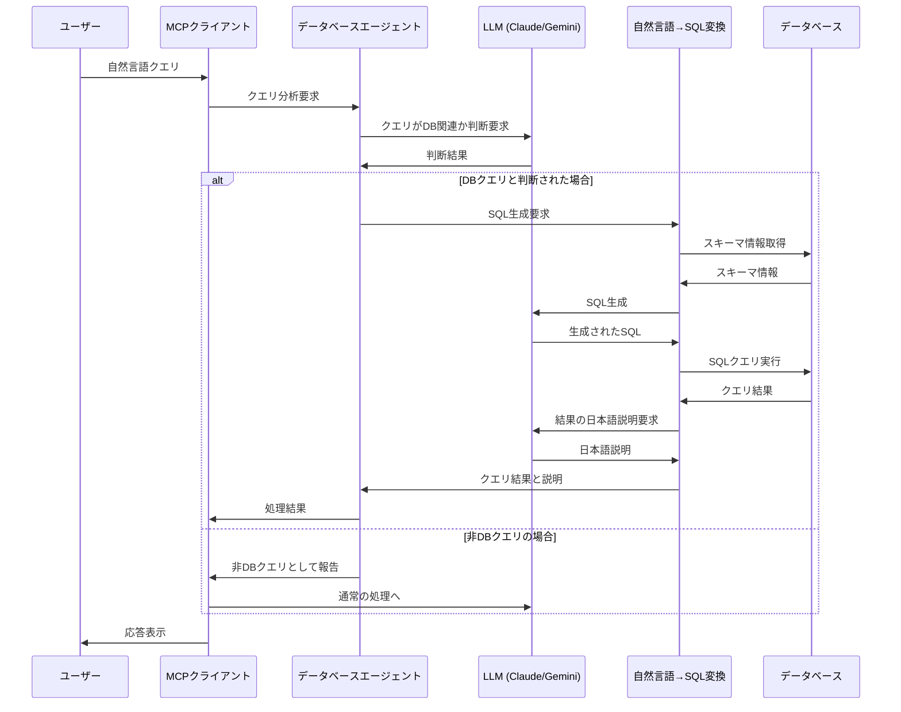

# MCP Client with LangGraph マルチエージェントシステム

## 概要

MCP Client は、Model Context Protocol (MCP) サーバーと通信するための Python クライアントです。SlackやGitHub、Notionなどの外部サービスとの連携を可能にし、大規模言語モデル（LLM）を使用してこれらのサービスとインタラクションできます。コードの問題を検出し、Notionにタスクを作成し、Slackで結果を共有するクロスサーバーワークフローをサポートします。

LangChainフレームワークを活用しており、モデルとツールの連携を効率的に実現します。また、**LangGraph**を使用したマルチエージェントシステムを実装しており、複数の専門エージェントが協調して動作します。

クライアントは以下の動作モードをサポートしています：
- **接続モード**: 簡易モード（外部サービス連携なし）と完全モード（フルAPI連携）
- **操作モード**: LangChainモード（単一エージェント）とLangGraphモード（マルチエージェント）

## コード構成

```
mcp-client/
├── client.py (メインエントリーポイント)
├── config.py (設定管理とエージェントプロンプト)
├── core/
│   ├── __init__.py
│   ├── base.py (ベースクラスと共通機能)
│   ├── graph.py (LangGraphによるマルチエージェント管理)
│   ├── session.py (サーバー接続とセッション管理)
│   └── utils.py (ユーティリティ関数)
├── agents/
│   ├── __init__.py
│   ├── db_agent.py (データベースクエリエージェント)
│   ├── github_agent.py (GitHub調査エージェント)
│   ├── notion_agent.py (Notionタスク作成エージェント)
│   └── slack_agent.py (Slack応答エージェント)
├── database/
│   ├── __init__.py
│   ├── agent.py (データベースクエリエージェント - 旧版)
│   ├── connection.py (データベース接続管理)
│   └── query.py (自然言語→SQL変換)
├── models/
│   ├── __init__.py
│   ├── anthropic.py (Anthropic/Claude関連)
│   └── gemini.py (Google Gemini関連)
├── services/
│   ├── __init__.py
│   ├── github.py (GitHub関連機能)
│   ├── notion.py (Notion関連機能)
│   └── slack.py (Slack関連機能)
├── tools/
│   ├── __init__.py
│   └── handlers.py (ツール呼び出し処理)
└── schema/
    ├── github.json
    ├── notion.json
    └── slack.json
```

## アーキテクチャ

### 基本アーキテクチャ

#### LangGraph マルチエージェントアーキテクチャ



#### 完全モード (Full Mode)



#### 簡易モード (Simple Mode)



### マルチサーバー連携アーキテクチャ



## 処理フロー

### LangGraph マルチエージェント処理フロー



### 基本的な処理フロー（旧版LangChainモード）

#### 完全モードの処理フロー



#### 簡易モードの処理フロー



### データベースクエリ処理フロー



## 主要クラスとモジュール

### メインクラス

- **MCPClient**: メインのクライアントクラス
  - 接続モード: `ConnectionMode.SIMPLE`（簡易モード）または`ConnectionMode.FULL`（完全モード）
  - 操作モード: `OperationMode.LANGCHAIN`（単一エージェント）または`OperationMode.LANGGRAPH`（マルチエージェント）
  - モデルプロバイダー: `anthropic`（Claude）または`gemini`（Google Gemini）
  - LangChainとLangGraph統合: 会話履歴の追跡、プロンプト管理、ツール連携、マルチエージェント管理

### LangGraphモジュール (core/graph.py)

- **GraphManager**: LangGraphを使用したマルチエージェントのグラフ管理
  - マルチエージェント間の状態共有と制御フローを管理
  - `AgentType`: CONTROLLER, DB_QUERY, GITHUB_RESEARCH, NOTION_TASK, SLACK_RESPONSE
  - `QueryType`: GENERAL, DB_QUERY, CODE_ISSUE, TASK_CREATION

### エージェントモジュール (agents/)

- **DBQueryAgent**: 自然言語からSQLを生成し、データベース検索を実行
- **GitHubResearchAgent**: GitHubリポジトリのコードを分析し、問題を特定
- **NotionTaskAgent**: GitHubリサーチ結果からNotionタスクを作成
- **SlackResponseAgent**: 各エージェントの結果を受け取り、ユーザーに適切な応答を生成

### コアモジュール (core/)

- **BaseMCPClient**: 基本的なセッション管理とクリーンアップ機能を提供
- **SessionManager**: MCPサーバーとの接続管理、LangChainツールの準備と管理

### モデルモジュール (models/)

- **AnthropicModelHandler**: LangChain経由でClaude APIを利用した処理
- **GeminiModelHandler**: LangChain経由でGemini APIを利用した処理

### データベースモジュール (database/)

- **DatabaseConnection**: データベース接続を管理するクラス
- **NaturalLanguageQueryProcessor**: 自然言語からSQLクエリを生成するクラス

### 設定モジュール (config.py)

- 環境変数の管理
- モデル設定
- LangChain関連の設定（温度、トークン制限、システムプロンプト）
- **エージェントプロンプト**: 各エージェントのプロンプトを一元管理

## 使用方法

### 動作モード

MCPクライアントには2つの接続モードと2つの操作モードがあります：

- **接続モード**:
  - **簡易モード (simple)**: 外部サービスに接続せず、LLMに直接クエリを送信
  - **完全モード (full)**: MCPサーバーを介して外部サービスに接続し、APIツールを活用

- **操作モード**:
  - **LangChainモード (langchain)**: 単一エージェントとして動作し、従来の実装アプローチを使用
  - **LangGraphモード (langgraph)**: マルチエージェントシステムとして動作し、専門エージェント間で協調処理

### 基本的なコマンド

```bash
# LangGraphモード（デフォルト） - 完全モード - Slack接続
uv run client.py --mode full --server slack --operation langgraph --model anthropic

# LangChainモード - 完全モード - Slack接続
uv run client.py --mode full --server slack --operation langchain --model anthropic

# LangGraphモード - 簡易モード（外部サービス連携なし）
uv run client.py --mode simple --operation langgraph --model anthropic

# LangChainモード - 簡易モード（外部サービス連携なし）
uv run client.py --mode simple --operation langchain --model anthropic

# 完全モード - GitHubサーバーに接続
uv run client.py --mode full --server github

# 完全モード - Notionサーバーに接続
uv run client.py --mode full --server notion

# 非対話モードでクエリを実行（Slackスレッド返信用）
uv run client.py --mode full --server slack --query "コード検索とタスク作成をしてください" --thread "1620841956.009700" --user "U01ABC123"
```

### 互換性のため以下の従来のコマンドもサポート

```bash
# 完全モード - LangGraphモード（デフォルト） - Slackサーバーに接続
uv run client.py --server slack

# 完全モード - LangGraphモード（デフォルト） - Claude - Slackサーバーに接続
uv run client.py --server slack --model anthropic
```

## 依存関係

- **LangChain関連**
  - `langchain`: LLMやツールを組み合わせるためのフレームワーク
  - `langchain-anthropic`: LangChainとAnthropic Claude APIの連携
  - `langchain-google-genai`: LangChainとGoogle Gemini APIの連携
  - `langchain-core`: LangChainのコア機能
  - `langchain-sql`: LangChainのSQL生成と実行機能

- **LangGraph関連**
  - `langgraph`: マルチエージェントシステム構築フレームワーク

- **モデルAPI**
  - `anthropic`: Claude APIとの通信
  - `google-generativeai`: Gemini APIとの通信

- **MCP関連**
  - `mcp`: Model Context Protocol実装
  - `python-dotenv`: 環境変数の読み込み

- **データベース関連**
  - `sqlalchemy`: データベース操作のためのORMとSQLツールキット
  - `mysqlclient`: MySQLデータベースドライバ
  - `psycopg2-binary`: PostgreSQLデータベースドライバ

## 拡張性

### エージェントの追加

LangGraphマルチエージェントシステムは拡張性を考慮して設計されています。新しいエージェントを追加するには：

1. `agents/` ディレクトリに新しいエージェントクラスを作成
2. `config.py` の `AGENT_PROMPTS` に新しいエージェント用のプロンプトを追加
3. `core/graph.py` の `AgentType` に新しいエージェントタイプを追加
4. `GraphManager` クラスの `initialize_agents` メソッドで新しいエージェントを初期化
5. 必要に応じてグラフのエッジ構造を更新

### サーバーの追加

新しいMCPサーバーを追加するには：

1. 対応するスキーマファイルを `schema` ディレクトリに追加
2. 必要に応じて新しいサービスクラスを `services/` に追加
3. 必要に応じて新しいエージェントを `agents/` に追加

### データベース機能の設定

データベースへの接続と自然言語クエリ機能を使用するには：

1. 環境変数で接続情報を設定：
   ```
   DB_TYPE=mysql  # mysql, postgresql, sqlite のいずれか
   DB_HOST=localhost
   DB_PORT=3306
   DB_USER=username
   DB_PASSWORD=password
   DB_NAME=your_database
   DB_SCHEMA_DESCRIPTION="データベースのテーブルと列に関する説明"  # オプション
   ```

2. サポートされているデータベース：
   - MySQL
   - PostgreSQL
   - SQLite

3. 使用例：
   ```
   # 自然言語でデータベース検索
   uv run client.py --mode simple --model anthropic
   > データベースの全ユーザー数を教えて
   > アクティブなプロジェクトを開始日の新しい順に5件表示して
   > user_idが10のユーザーが担当しているタスクの完了率は？
   ```

## エージェントプロンプトのカスタマイズ

各エージェントのプロンプトは `config.py` の `AGENT_PROMPTS` ディクショナリで一元管理されており、簡単に変更できます。

例えば、GitHubリサーチエージェントのプロンプトを変更するには：

```python
AGENT_PROMPTS = {
    # ... 他のプロンプト ...
    
    "github_research": """
    あなたはGitHubリポジトリのコードを調査するAIエージェントです。
    コードの問題を発見し、分析する専門家としての役割があります。
    
    # カスタマイズされた新しい指示をここに追加
    1. セキュリティ脆弱性にも注目する
    2. パフォーマンス最適化の提案を含める
    3. コーディング規約違反も報告する
    
    分析結果は明確かつ具体的に説明し、問題の重大度も示してください。
    コードのどの部分に問題があるのか、なぜ問題なのかを専門的な観点から説明してください。
    """,
    
    # ... 他のプロンプト ...
}
```

## 参考URL

- [LangGraph ドキュメント](https://langchain-ai.github.io/langgraph/)
- [Model Context Protocol](https://modelcontextprotocol.io/quickstart/client)
- [Anthropic Claude API](https://docs.anthropic.com/claude/reference/getting-started-with-the-api)
- [Google Gemini API](https://ai.google.dev/docs)
- [LangChain](https://www.langchain.com/)
- [LangChain ドキュメント](https://python.langchain.com/docs/get_started/introduction)
- [LangChain SQL ドキュメント](https://python.langchain.com/docs/modules/chains/popular/sqlite)
- [SQLAlchemy ドキュメント](https://docs.sqlalchemy.org/)